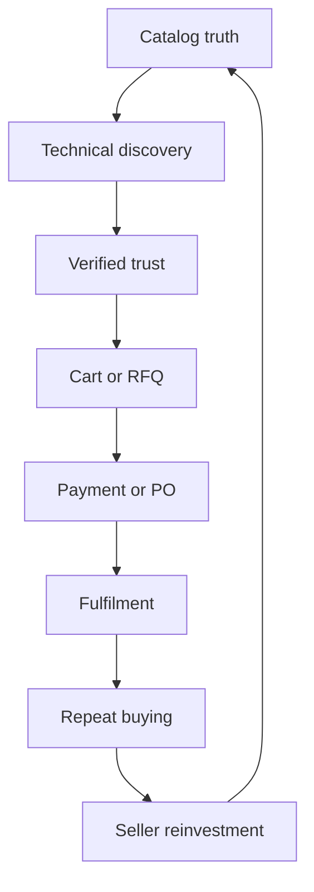

# Revenue Fountain roadmap

Research baseline: 2026-09-30  
Product thesis: the GCC trade register turned into a trusted commerce engine

## North star

Grow **90-day repeat net merchandise value, reported per currency**, by making
every commercial loop faster and more trustworthy. GMV alone is not enough:
the operating view must also show refunds, discounts, commission, payout
liability, fulfilment, quote conversion, and repeat buying.

## Proven patterns to adapt

| Pattern | Proven operator | Avenick application |
| --- | --- | --- |
| Company-specific catalog, availability, pricing, quantity rules | Shopify B2B | Contract catalogs, location-aware availability, quantity tiers, and buyer-specific terms |
| Business prices, bulk tiers, pricing recommendations | Amazon Business | Seller profitability workbench and governed promotion suggestions |
| Net terms and first-order risk reversal | Faire | Approved company terms, transparent eligibility, and evidence-backed return protection |
| Escrow, order protection, dispute mediation | Alibaba | A future buyer-protection layer only after payment custody, logistics evidence, and dispute operations are real |
| Deep category filters and comparable technical facts | Leading industrial commerce UX | Attribute completeness, part numbers, datasheets, substitutes, bulk entry, and quote comparison |

The design rule is ethical persuasion: reduce effort, show real progress, expose
real economic upside or loss, and use only measured proof. No invented urgency,
ratings, benchmarks, badges, or scarcity.

## Release sequence

### R0 — Commercial truth and foundation (implemented in this branch)

- One canonical seller performance score; insufficient history displays as
  “not enough data” instead of a fabricated perfect score.
- Seller readiness counts active listings, approved required documents, payout
  setup, and paid order lines; actions respect membership capabilities.
- RFQ accept/reject failures are visible, unsupported quote-comparison and
  automatic-PO claims are removed, and catalog ratings reach product cards.
- Catalogue editors can reach the edit workflow without also receiving pricing
  authority.
- Banking details use versioned field encryption for new writes, with a
  controlled legacy backfill command.
- Relation-leading indexes, commerce write constraints, migration manifest, and
  schema regression checks establish the database growth contract.
- Shared combobox and timeline gain bilingual accessible semantics, keyboard
  operation, focus visibility, and token-aligned presentation.

### R1 — Close the revenue loop (next)

1. Multi-supplier RFQ invitations, immutable quote revisions, comparable terms,
   acceptance, notification, and atomic draft-PO creation.
2. Certified card/Mada/Apple Pay/STC Pay flows alongside bank transfer, plus
   complete Saudi National Address collection and validation.
3. Seller bulk create/update import with mapping, validation preview, governed
   review, and per-row recovery.
4. Seller pick-pack-ship workflow requiring shipment, carrier, tracking, and
   handoff evidence before “shipped.”
5. Buyer/seller support case creation linked to order, RFQ, return, or payout.
6. Event taxonomy for search → PDP → save/cart/RFQ → checkout → paid → repeat,
   with consent, retention, and seller/company isolation.

### R2 — Compound repeat revenue

- Account-synced carts, requisition lists, wishlists, checkout drafts, and
  reorder prompts.
- Seller growth cockpit: SKU conversion, RFQ aging, stockout revenue at risk,
  repeat buyers, margin, promotion lift, and per-currency earnings.
- Seller-scoped CRM, saved exception views, campaign drafts with platform
  approval, and predictable payout calendars/reconciliation.
- Admin revenue control plane: net GMV, take rate, refund burn, payout liability,
  supply gaps, seller activation, campaign ROI, and unified exception queues.

### R3 — Scale after measurement

- ERP/PIM/WMS connection center, automated catalog quality, and governed
  exception handling.
- Measured query/index tuning, archival and partitioning thresholds, read
  replicas, and disposable caches.
- Buyer protection/escrow only with licensed payment operations, custody rules,
  clear terms, and complete dispute evidence.

## Scorecard

| Flywheel stage | Primary metric | Guardrail |
| --- | --- | --- |
| Activation | Time to 10 sellable SKUs | Approval and compliance accuracy |
| Discovery | Search success and PDP engagement | Zero-result and filter-exit rate |
| Quote | Submitted → comparable quote → accepted → PO | Response time and quote expiry |
| Checkout | Checkout start → paid | Refusal/error rate and total-cost clarity |
| Fulfilment | Paid → dispatched → delivered | Late, cancellation, return, and dispute rate |
| Retention | 30/60/90-day repeat net value | Refund-adjusted contribution margin |
| Seller growth | Active assortment and promotion lift | Stockouts, payout holds, and margin floor |

Every monetary dashboard groups by currency unless it has an explicit exchange
rate, source, and timestamp. Every percentage publishes its numerator,
denominator, period, and inclusion rules.

## Research sources

- [Shopify B2B catalogs and pricing](https://help.shopify.com/en/manual/b2b/catalogs)
- [Amazon B2B prices and quantity discounts](https://sell.amazon.com/blog/amazon-b2b-prices)
- [Faire wholesale marketplace](https://www.faire.com/)
- [Alibaba Trade Assurance](https://tradeassurance.alibaba.com/)
- [Baymard product-list and filtering research](https://baymard.com/research/ecommerce-product-lists)
- [Baymard cart and checkout research](https://baymard.com/lists/cart-abandonment-rate)
